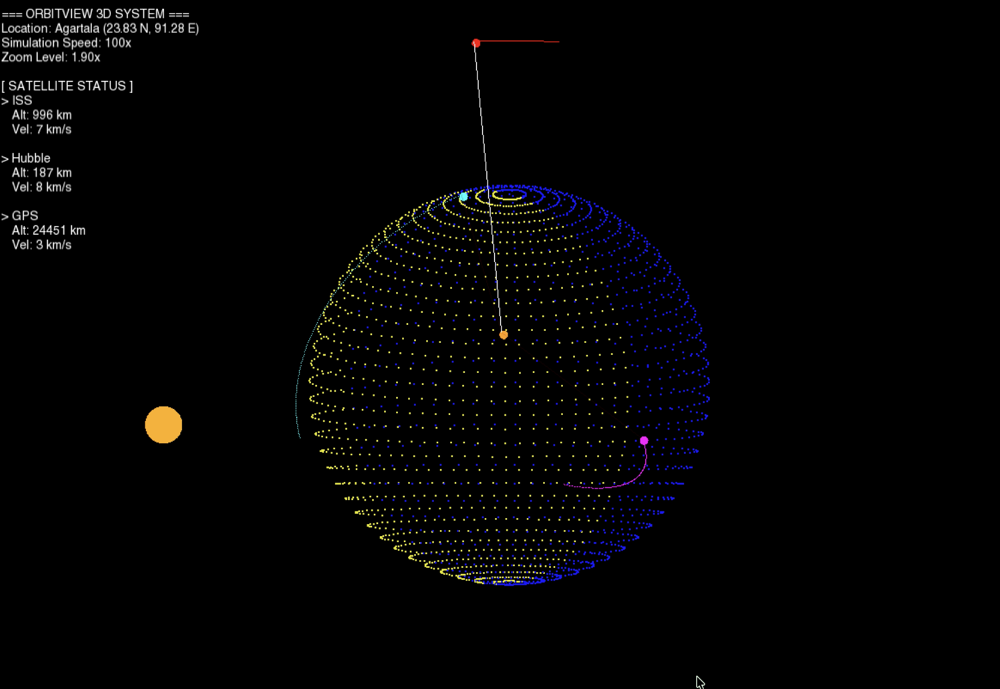

# OrbitView 3D 🛰️

> **Who needs a telescope when you have C++?**

  

**OrbitView 3D** is a high-fidelity orbital mechanics simulator built entirely from scratch. It doesn't use game engines like Unity or Unreal—every pixel, every orbit, and every 3D projection is calculated using raw mathematics and C++.


*(Note: Upload a screenshot of your project and rename it 'dashboard.png' in your repo)*

---

## 🚀 Why I Built This
I wanted to bridge the gap between abstract physics equations and visual reality. Starting with Newton's Law of Gravitation, I built a physics engine that evolved from a simple 2D map into a full 3D simulation capable of tracking real-world satellites like the ISS and Hubble.

## ✨ Key Features

### 1. Custom Physics Engine ⚛️
* **Newtonian Gravitation:** Implements `F = G*M*m / r^2` for accurate orbital dynamics.
* **Numerical Integration:** Uses the **Semi-Implicit Euler** method for symplectic stability (orbits don't degrade over time).
* **Real-World Data:** Parses NASA **Two-Line Element (TLE)** sets to simulate real satellites with live orbital parameters.

### 2. Custom 3D Renderer 🌍
* **No 3D Libraries:** I wrote the perspective projection and rotation matrix math manually to turn 2D SFML shapes into a 3D world.
* **Wireframe Earth:** Generates a procedural sphere mesh.
* **Day/Night Cycle:** Simulates the "Terminator Line" using vector dot products to calculate sun exposure in real-time.

### 3. Mission Control Tools 📡
* **Ground Station Tracking:** Calculates visibility from my home station in **Agartala, India**.
* **Laser Links:** Draws a green visualization line when a satellite rises above the local horizon.
* **Heads-Up Display (HUD):** Live telemetry showing Altitude, Orbital Velocity, and Connection Status.

---

## 🎮 Controls

| Key | Action |
| :--- | :--- |
| **Arrow Keys** | Rotate Camera around Earth |
| **Z** | Zoom In (Micro Scale) |
| **X** | Zoom Out (Macro Scale - see GPS orbits) |
| **1, 2, 3** | Toggle focus (Future feature) |

---

## 🛠️ Installation & Build

### Prerequisites
* **C++ Compiler** (Clang/GCC)
* **SFML 3.0** library installed.

### Compilation
Clone the repo and run the build command:

```bash
# Clone the repository
git clone [https://github.com/YOUR_USERNAME/OrbitView-3D.git](https://github.com/YOUR_USERNAME/OrbitView-3D.git)
cd OrbitView-3D

# Compile (MacOS/Linux)
clang++ OrbitView3D.cpp -o orbit3d -std=c++17 -lsfml-graphics -lsfml-window -lsfml-system

# Run
./orbit3d

📐 The Math Behind It
The engine relies heavily on Linear Algebra and Vector Calculus.

->State Vectors: Converting Keplerian Elements (a,e,i,Ω,ω,M) into Cartesian Vectors ( r,v ).
->Coordinate Transforms: Converting Earth-Centered Inertial (ECI) frames to Earth-Centered Earth-Fixed (ECEF) for ground tracking.


Read the report to Get the full physics understanding


